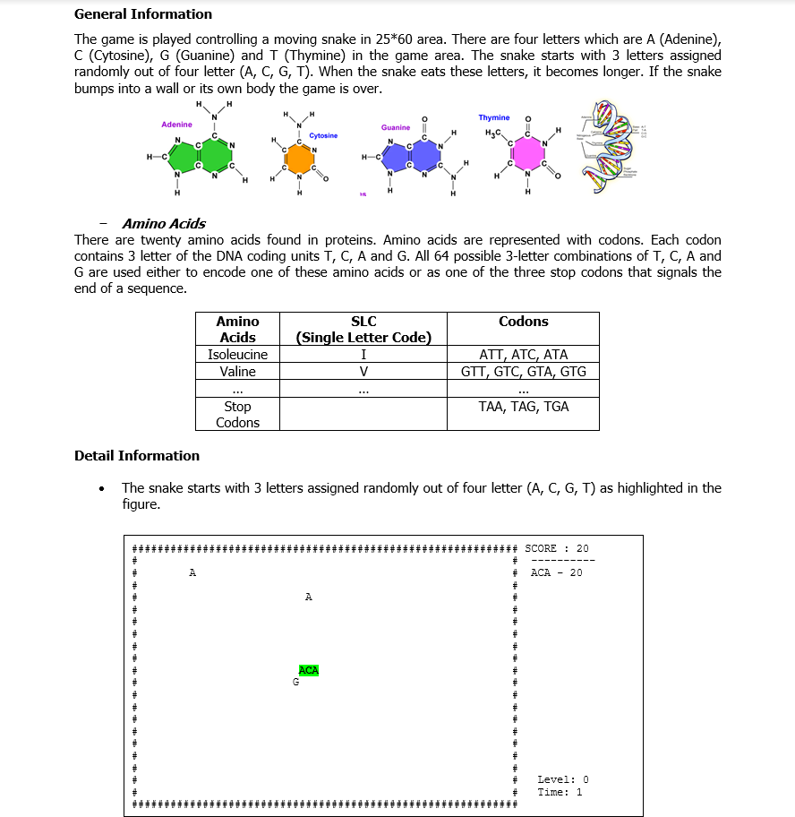
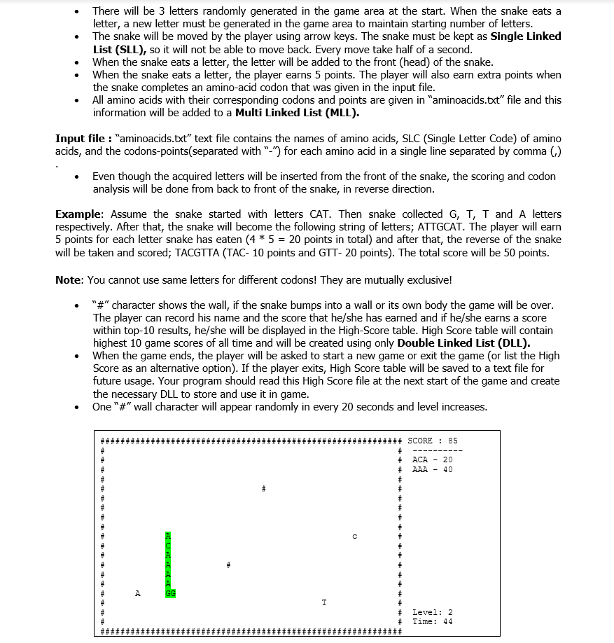

# Helix Snake

- The goal of the project is to develop a snake game version which can generate amino acids’ codons.
- The snake is controlled with left-right arrow keys, it grows by eating amino acids and points are earned according to the eaten codons.
- Linked list data structures (SLL, DLL and MLL) used to implement the game.
- Enigma used for visualization. ("enigma.jar" file should be imported.)
- Information About Game :

 
